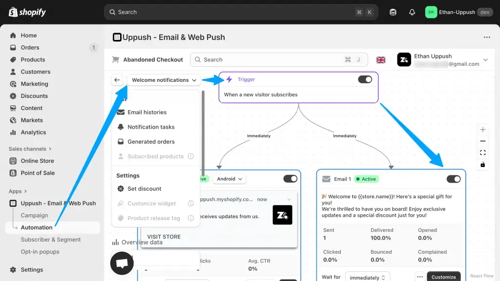
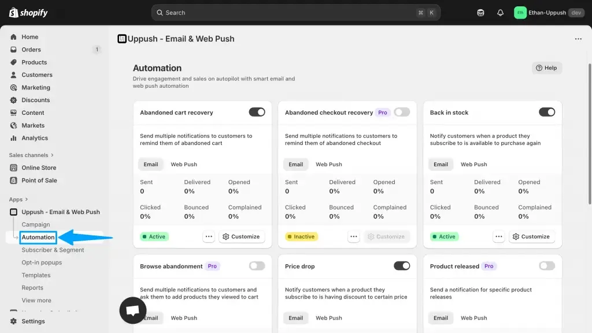

Manually sending follow-up emails takes time — but with Uppush, you can automate much of it effortlessly. Our automation tools help you stay connected with customers and boost conversions, and most are **available for free**.

## What Are Email Automations?

Email automations are messages that send automatically based on customer behavior. For example:

-   A visitor subscribes to your popup → send a **[welcome email](https://docs.uppush.io/popup-and-automation/how-to-enable-automations/welcome-notifications)**
-   A shopper adds items to their cart but doesn’t check out → send an **abandoned cart reminder**
-   A product that a customer is interested in is back in stock → send a **back in stock notice**

You can view & edit each email automation flow

These workflows run automatically once set up, helping you recover lost sales and engage your audience without manual effort.

## Why You’ll Love This Feature

-   **Set it and forget it:** Build once and let your automations run on their own.
-   **Recover lost sales:** Reach shoppers who left mid-purchase.
-   **Build engagement:** Welcome new subscribers with personalized emails.
-   **Free to start:** Core automations like Welcome, Abandoned Cart, and Back In Stock are available on the free plan — with more advanced workflows in the Pro plan.

You can manage and customize your automations under the **Automation** tab in Uppush. Adjust the content, timing, and design to match your store’s voice, and send test emails before going live.

Many of our automations are available for free

## Combine With Other Free Tools

Automations work best when paired with other Uppush features.  
Use **[Email Popups](/grow-your-list-with-free-email-popups/)** to capture subscribers, and **[Web Push Notifications](/reach-more-shoppers-with-free-web-push-notifications/)** to re-engage those who don’t leave an email. Together, they create a smooth marketing flow — turning visitors into customers.

> Automate your marketing for free — **[Install Uppush on Shopify](https://apps.shopify.com/pushup-notification-marketing?st_source=uppush_web&st_position=blog_post_body)**
