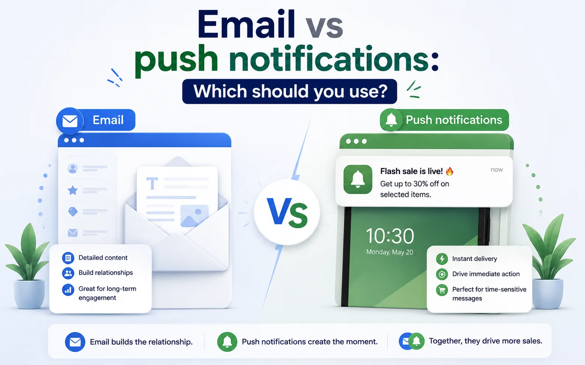

Getting a customer to visit your Shopify store is only the beginning.

The bigger challenge is keeping that customer engaged after they leave. Some visitors browse a few products and disappear. Others add items to their cart but never complete checkout. Existing customers may not even realize you’ve launched a new collection or started a sale.

That’s why communication channels matter. For most ecommerce businesses, email marketing has been the default choice for years. More recently, web push notifications have become another effective way to bring shoppers back without relying only on email or paid advertising.

So which one should you use? The short answer is neither channel is better in every situation.

Email and push notifications solve different problems. Understanding those differences is the key to building a marketing strategy that feels helpful instead of overwhelming.

In this guide, we’ll compare email and web push notifications, explain where each channel performs best, and show how Shopify stores can combine them to recover more carts, increase repeat purchases, and build stronger customer relationships.



* * *

## Email and push notifications aren’t competitors

Many merchants approach this as an either-or decision. Should they invest in email marketing? Or should they focus on web push notifications? In reality, the most successful Shopify stores don’t replace one channel with another. They use each one where it performs best.

Think of email as having a conversation. You have room to explain, educate, tell a story, recommend products, or build trust.

Push notifications are different. They’re closer to a tap on the shoulder: short, immediate, focused on one action. Instead of replacing email, they help customers notice the moments that matter.

* * *

### What is email marketing?

Email marketing allows businesses to communicate directly with customers through their inbox. Subscribers usually join by entering their email address through a popup, newsletter form, checkout, or account registration. Because customers intentionally share their email address, email works well for building long-term relationships.

You can explain products, introduce your brand, recommend collections, answer questions, and create automated customer journeys that continue long after the first visit. For Shopify stores, email remains one of the strongest channels for welcome series, abandoned cart recovery, newsletters, seasonal promotions, post-purchase follow-ups, and customer retention.

* * *

#### What are web push notifications?

Web push notifications are short browser messages that customers receive after choosing to allow notifications from your website. Unlike email, visitors don’t need to complete a form or share personal information. Subscribing usually takes a single click. Because notifications appear directly on a customer’s device, they’re designed for speed rather than explanation.

A notification might remind someone about an abandoned cart, announce a flash sale, or let subscribers know that a product is back in stock. The goal isn’t to tell a long story. It’s to encourage immediate action.

* * *

### Email vs push notifications: What’s the difference?

Although both channels help you reconnect with customers, they work in very different ways.

| Feature | Email marketing | Web push notifications |
| --- | --- | --- |
| Subscription | Requires an email address | One-click browser permission |
| Message length | Long-form content | Short messages |
| Best for | Education, promotions, automation | Immediate reminders and alerts |
| Visibility | Depends on inbox activity | Appears instantly on the device |
| Rich content | Images, multiple products, long copy | Short text, icon, CTA |
| Customer relationship | Long-term communication | Immediate engagement |
| Typical goal | Build trust and increase lifetime value | Bring shoppers back quickly |

Rather than asking which one performs better, ask which one matches the customer’s current situation.

* * *

### When to use them?

#### When should you use email marketing?

Email works best when customers need context before taking action. Suppose you’re launching a new product line. A push notification can tell customers that something new has arrived. An email can explain why it’s worth buying. The same applies to educational content.

If you’re selling skincare, coffee equipment, supplements, or fashion, customers often need more information before making a decision. Email gives you room to explain benefits, answer common questions, show customer reviews, and recommend related products.

It’s also ideal for longer automated journeys like welcome series, post-purchase emails, win-back campaigns, and newsletters. If the goal is building a relationship, email usually wins.

* * *

#### When should you use push notifications?

Push notifications perform best when timing matters.

Imagine someone adds a product to their cart but leaves before paying. Waiting until tomorrow to send an email may still work, but sending a push notification thirty minutes later often feels more natural because the shopping session is still fresh in the customer’s mind.

The same idea applies to flash sales. If your promotion only lasts six hours, you don’t want customers discovering your email tomorrow morning. Push notifications also work particularly well for back-in-stock alerts, price-drop notifications, limited inventory warnings, and short promotional campaigns.

Whenever speed is more important than explanation, push notifications are usually the better choice.

* * *

### Customer journey: When should you use each channel?

One of the easiest ways to decide is by looking at the customer journey instead of individual campaigns.

| Customer action | Best channel | Why |
| --- | --- | --- |
| New visitor subscribes | Email | Introduce your brand and deliver welcome offers. |
| Customer browses products | Push | A quick reminder can bring them back while interest is still high. |
| Customer abandons cart | Push + Email | Push grabs attention first, email provides more information. |
| Product back in stock | Push | Customers expect immediate updates. |
| Price drops | Push + Email | Push creates urgency, email explains the offer. |
| New collection | Email | More room to showcase products and tell the story. |
| Weekly newsletter | Email | Better for educational or promotional content. |
| Flash sale | Push | Immediate visibility increases urgency. |
| Post-purchase follow-up | Email | Great for product education and cross-selling. |

Instead of choosing one channel for everything, match the channel to the customer’s intent.

* * *

### Why combining email and push works better

Let’s imagine a customer visits your Shopify store. They browse several products. They add one to their cart. Then they leave.

If your only recovery method is email, the customer needs to notice the email, open it, read it, and click back to your store. If your only recovery method is push, they receive the reminder but don’t get additional information that might answer their questions.

Using both channels creates a smoother experience. The push notification quickly reminds the customer that their cart is waiting. If they don’t return, the follow-up email can explain shipping, returns, product benefits, customer reviews, or even include a limited-time incentive.

Each message has a different purpose. Together, they create a much stronger recovery workflow than either channel alone.

* * *

### Common mistakes merchants make

One of the biggest mistakes is _trying to replace email with push notifications_.

Push is excellent for short reminders, but it isn’t designed for detailed communication. The opposite mistake is relying entirely on email for time-sensitive campaigns. If you’re announcing a flash sale that ends tonight, waiting for customers to check their inbox may reduce your results.

Another common problem is _sending identical messages across both channels_.

Customers don’t need to receive the exact same sentence twice. Instead, let each channel do what it does best.

Finally, _avoid sending too many notifications_.

Whether you’re using email or push, relevance always matters more than frequency.

* * *

### How Uppush helps Shopify merchants use both channels

Many Shopify stores end up managing separate tools for email marketing and web push notifications. That often means building duplicate automations, maintaining different customer segments, and tracking performance across multiple dashboards.

[Uppush](https://apps.shopify.com/pushup-notification-marketing?st_source=uppush_web&st_position=blog_post_body) brings both channels together in one Shopify-focused platform. You can automate welcome emails, abandoned cart recovery, browse abandonment, back-in-stock alerts, price-drop notifications, newsletters, and web push campaigns from the same workflow.

Instead of deciding between email or push, you can use both together based on how customers interact with your store.

* * *

### 10 real Shopify scenarios: Should you use email or push?

One of the easiest ways to decide between email and push notifications is to stop thinking about marketing channels and start thinking about customer situations.

Every message has a purpose. Some situations require more explanation, while others simply need to catch the customer’s attention quickly. Choosing the right channel becomes much easier when you look at what the customer is trying to do.

#### Scenario 1: A visitor has just subscribed

**Best choice: Email**

Someone has just trusted your brand enough to subscribe. This is the perfect opportunity to introduce your business, deliver any promised discount, explain your products, and encourage their first purchase.

A push notification at this stage usually doesn’t provide enough information to build that initial relationship.

* * *

#### Scenario 2: A customer abandons their cart

**Best choice: Push first, email second**

The customer was already close to buying.

A push notification sent within the first hour acts as a quick reminder while the shopping session is still fresh.

If they don’t return, a follow-up email can provide product details, customer reviews, shipping information, or answer common questions that may have prevented the purchase.

* * *

#### Scenario 3: A product comes back in stock

**Best choice: Push**

Customers waiting for an unavailable product usually want one thing:

To know immediately when it’s available again.

Speed matters much more than detailed content.

A short notification saying **“It’s back in stock”** often works better than a long email.

* * *

#### Scenario 4: You launch a completely new collection

**Best choice: Email**

New collections deserve more than one sentence.

Customers want to see product images, understand the inspiration behind the launch, browse different styles, and discover which products fit their needs.

Email gives you enough space to create that experience.

* * *

#### Scenario 5: Your flash sale starts in one hour

**Best choice: Push**

A promotion lasting only a few hours doesn’t leave much room for delayed communication.

Push notifications appear almost immediately and encourage customers to act while the offer is still available.

* * *

#### Scenario 6: A customer hasn’t purchased for three months

**Best choice: Email**

This customer doesn’t simply need a reminder.

They need a reason to return.

A re-engagement email can recommend products based on previous purchases, share new arrivals, offer exclusive discounts, or remind customers what made your brand valuable in the first place.

* * *

#### Scenario 7: A shopper views the same product several times

**Best choice: Push**

Repeated product views often indicate genuine interest.

A gentle notification encouraging them to take another look may be all they need before making a purchase.

* * *

#### Scenario 8: You publish a buying guide

**Best choice: Email**

Educational content rarely works inside a notification.

If you’ve written a guide explaining how to choose running shoes, skincare products, or coffee equipment, email provides enough room to summarize the article and encourage readers to continue on your website.

* * *

#### Scenario 9: Your customer just completed an order

**Best choice: Email**

After a purchase, customers often want order confirmations, shipping information, product usage tips, or recommendations for complementary products.

Email handles all of these naturally.

* * *

#### Scenario 10: You want more repeat customers

**Best choice: Both**

Retention isn’t built with one campaign.

Email keeps customers engaged through newsletters, recommendations, and educational content.

Push notifications remind them about new products, exclusive offers, or limited-time events.

Together, they create regular touchpoints without relying entirely on paid advertising.

* * *

## A simple decision tree

Many merchants still ask the same question:

**Should I send an email or a push notification?**

Instead of looking at the marketing channel, start with the customer’s goal.

```
Do customers need more information?
            │
          Yes
            │
        Send Email
            │
            ▼
Need immediate attention?
            │
          Yes
            │
   Send Push Notification
            │
            ▼
Need both explanation and urgency?
            │
          Yes
            │
Push first → Email follow-up
```

This simple framework works for almost every Shopify campaign.

If the customer needs to **understand**, choose email. If the customer needs to **notice**, choose push. If they need **both**, let each channel do what it does best.

## Final thoughts

So, should you choose email or push notifications? The answer depends on what you’re trying to achieve.

If you need to educate customers, introduce products, build trust, or nurture long-term relationships, email is the better choice.

If you need to grab attention quickly, recover abandoned carts, announce flash sales, or send time-sensitive alerts, web push notifications are often more effective.

The strongest Shopify marketing strategies don’t treat these channels as competitors. They treat them as teammates. Email tells the story. Push creates the moment. When those two channels work together, they help shoppers move naturally from discovering your store to completing their purchase – and coming back again.
