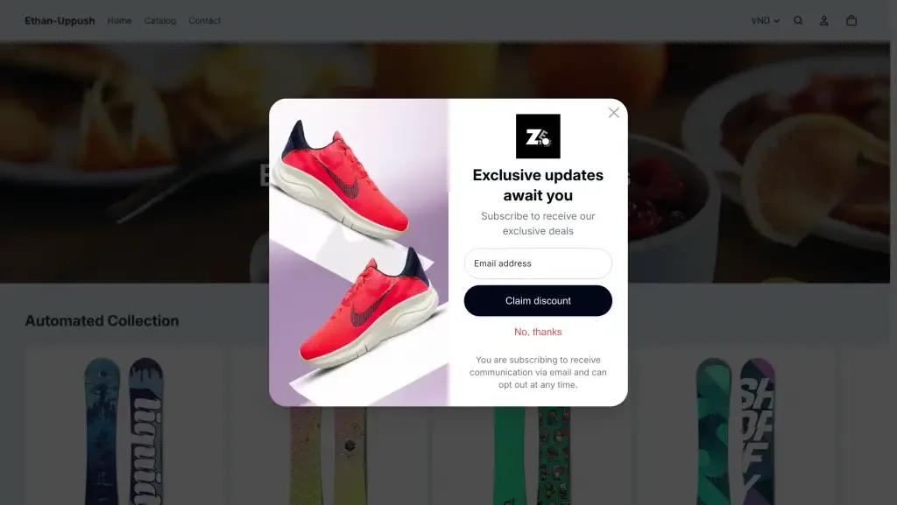
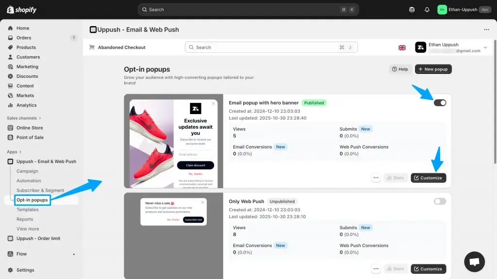
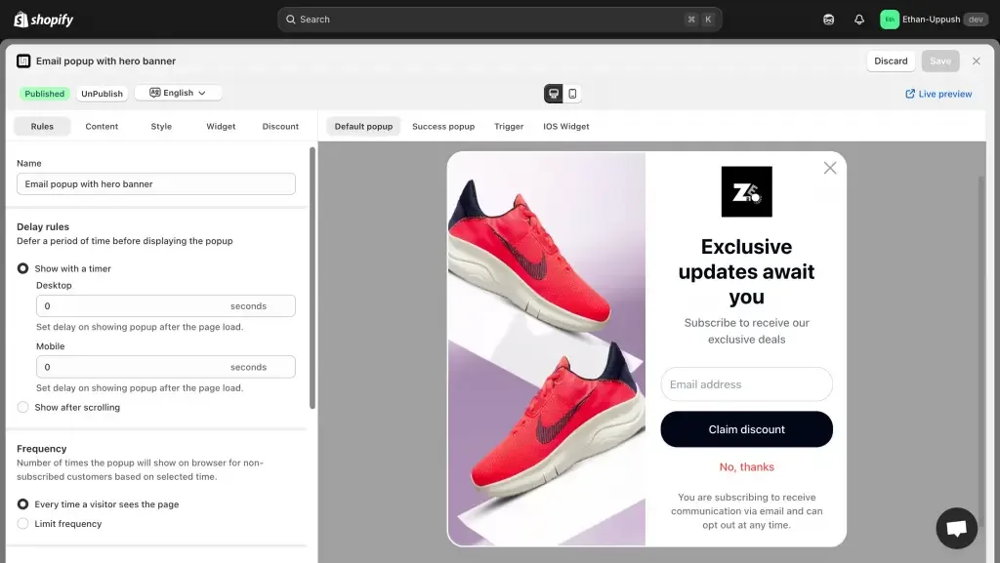
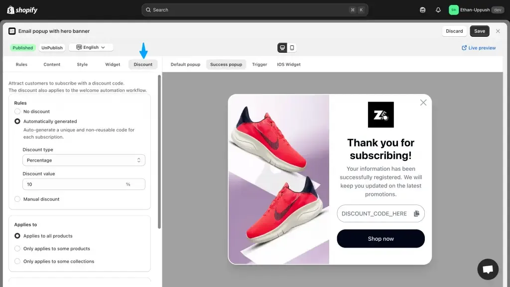
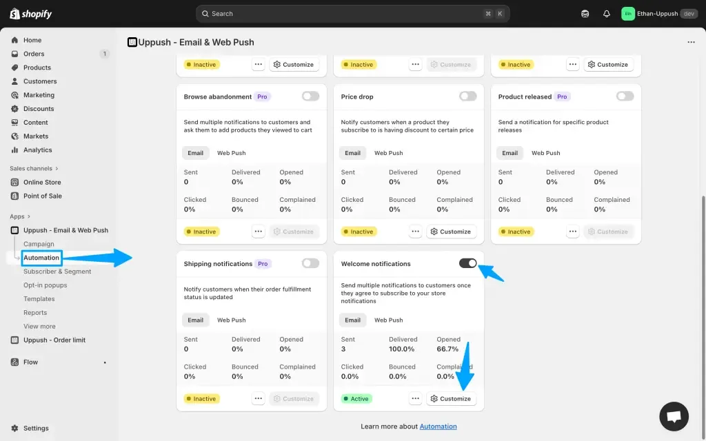

Your store visitors are most engaged while browsing your site — that’s the perfect time to invite them to subscribe.

With Uppush, you can create beautiful **email popups** to collect subscribers automatically, with no coding required. Best of all, it’s completely **free**.

Using Uppush, you can quickly set up a beautiful Pop-up on your Shopify store for free

## Why Email Popups Matter

Email marketing is still one of the most reliable ways to grow sales. But to run effective email campaigns, you first need a quality list of subscribers — people who actually want to hear from you.

Popups are the easiest way to do that. They appear at just the right moment — when someone’s been browsing for a while, or is about to leave your site — and encourage them to sign up for updates, discounts, or special offers.

Every subscriber you collect is a long-term connection you own, not dependent on social media algorithms or ad platforms.

## How to Set It Up

In Uppush, go to **Opt-in popups → Enable Email Popup** and to publish a ready-made template. You can customize the text, colors, images, and timing in just a few clicks.

How to enable and customize your Email popup in Uppush

Then, decide when and where your popup appears:

-   Immediately, or after a few seconds on site
-   When a visitor scrolls down a page
-   On either Desktop or Mobile, or both

Additional customization and settings for the popup

You can also fine-tune advanced settings, like:

-   Showing the popup only on specific pages
-   Targeting or excluding specific countries
-   Adjusting frequency limits, or simply using the default setting (shown immediately, on all pages, without limits)

Finally, click **Save** and **Publish** your Popup and you’re ready to start collecting emails.

> All collected emails are automatically stored in your Uppush contact list, and synced to your list of Shopify customers, ready to be used for campaigns and automations.

## Offer a Discount to New Subscribers

To boost signups, you can easily **offer a discount code** after someone subscribes.  
Just open the **Discount** tab in your popup settings.

Optional Discount options for the popup

You can choose between:

-   **Automatically generated codes** – Uppush will create one-time discount codes in your Shopify store and display them to each new subscriber.
-   **Manual discount codes** – Create a reusable code in Shopify and paste it into Uppush.

(For a step-by-step guide, **[click here see our detailed doc on setting up discount codes.](https://docs.uppush.io/popup-and-automation/how-to-set-up-discount-codes-in-opt-in-popups-and-automated-emails)**)

### Take It Further with Automations

Once your popup starts collecting emails, you can automatically greet new subscribers with **welcome messages** or special offers.  
Head to **Automations** in Uppush to set these up.

It’s a great idea to also setup Automations to take full advantage of the collected emails

And if you’re also using **[Web Push Notifications](/reach-more-shoppers-with-free-web-push-notifications/)**, you’ll reach both email subscribers and non-subscribers for maximum coverage.

> Start collecting more subscribers for free — [**Install Uppush on Shopify**](https://apps.shopify.com/pushup-notification-marketing?st_source=uppush_web&st_position=blog_post_body).
