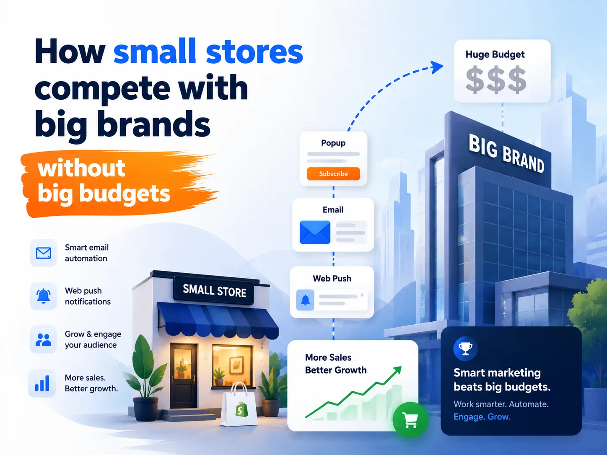

Large brands have larger teams, larger advertising budgets, and stronger brand recognition. At first glance, it may seem impossible for a small Shopify store to compete. But today’s ecommerce market tells a different story.

Many successful small stores are not winning because they spend more. They win because they market smarter. They focus on reaching the right customers, automating repetitive work, and making every marketing dollar count.

If you’re running a small Shopify store, here’s the good news: you don’t need a six-figure marketing budget to grow. You need a strategy that helps you maximize every visitor and every customer. Let’s look at how small stores can compete effectively with much bigger brands.

* * *

## Why big budgets don’t always win

Big brands often invest heavily in paid advertising because they can afford rising acquisition costs. Small businesses usually can’t. That means every click, every email subscriber, and every returning customer matters much more. Instead of trying to outspend competitors, successful Shopify merchants focus on:

-   Increasing repeat purchases
-   Recovering lost sales
-   Building owned marketing channels
-   Automating customer engagement
-   Improving conversion rates

These improvements often generate more revenue than simply increasing ad spend.

* * *

## Build your own marketing channels instead of renting them

One of the biggest mistakes small businesses make is depending entirely on paid ads. The moment you stop paying, your traffic disappears. Instead, invest in channels you own – especially email and web push notifications. Every subscriber becomes a long-term asset that you can reach without paying for another click.

This is where smart marketing automation makes a huge difference. Platforms like Uppush help Shopify merchants combine email marketing and web push notifications into one simple workflow. Instead of manually following up with visitors, you can automatically reconnect with them based on their shopping behavior.

Some examples include:

-   Recover abandoned carts automatically
-   Remind shoppers about abandoned checkouts
-   Notify customers when products are back in stock
-   Send price drop alerts
-   Welcome new subscribers
-   Launch email and web push campaigns from one platform
-   Grow your subscriber list with customizable popups and spin wheel campaigns
-   Segment customers for more relevant messaging

Instead of paying to reacquire the same visitor through ads, you’re building a marketing system that keeps bringing people back automatically.

* * *

## Recover visitors before buying more traffic

Most visitors don’t purchase on their first visit. They compare products. They get distracted. They leave. For many stores, this represents the biggest missed revenue opportunity. Before increasing your advertising budget, ask yourself:

**How many visitors are leaving without any follow-up?**

Recovering even a small percentage of abandoned carts or product viewers can often generate more revenue than buying additional traffic. Smart automations help bring those visitors back with timely reminders while the products are still fresh in their minds.

* * *

## Make every message relevant

Customers receive hundreds of marketing messages every week. Generic promotions rarely stand out. Instead of sending the same campaign to everyone, personalize your communication based on customer behavior.

Examples include:

-   New visitors receive welcome offers.
-   Returning shoppers see products similar to previous purchases.
-   Loyal customers receive exclusive promotions.
-   Interested shoppers receive back-in-stock or price-drop notifications.

Relevant messages create better customer experiences while improving open rates, click-through rates, and conversions.

* * *

## Focus on retention, not just acquisition

Acquiring a customer is expensive. Keeping one is much cheaper. Many growing Shopify stores spend most of their budget finding new customers while overlooking people who have already purchased. Returning customers are often more likely to buy again because they already trust your brand.

Simple retention strategies include:

-   Product recommendations after purchase
-   Seasonal promotions
-   New product announcements
-   Exclusive discounts for existing customers
-   Loyalty-focused email campaigns
-   Win-back campaigns for inactive customers

Consistent communication keeps your brand top of mind and encourages repeat purchases over time.

* * *

## Let automation handle repetitive marketing

Small teams usually wear multiple hats. Marketing often becomes another task added to an already full schedule. Automation helps level the playing field. Instead of manually sending every campaign, set up workflows that respond automatically to customer actions.

For example:

-   Welcome new subscribers
-   Recover abandoned carts
-   Send browse abandonment reminders
-   Notify customers about price drops
-   Announce new product launches
-   Re-engage inactive customers

Once these automations are running, they continue generating revenue in the background while you focus on growing your business.

* * *

## Measure what actually drives revenue

Many merchants spend too much time watching vanity metrics like:

-   Likes
-   Followers
-   Impressions

Those numbers don’t always translate into sales.

Instead, focus on metrics that directly impact business growth:

-   Conversion rate
-   Revenue per visitor
-   Email revenue
-   Cart recovery rate
-   Repeat purchase rate
-   Customer lifetime value

Tracking these metrics helps you understand which marketing activities actually generate profit, and where your budget should go.

* * *

## Small stores can move faster than big brands

Large companies often require approvals, multiple teams, and lengthy planning cycles. Small businesses have a different advantage.

They can:

-   Test new ideas quickly
-   Launch campaigns in minutes
-   Adapt to customer feedback faster
-   Personalize communication more easily
-   Build stronger relationships with customers

Speed and flexibility are competitive advantages that money alone cannot buy.

* * *

## Final thoughts

Competing with large brands doesn’t require matching their budget. It requires making smarter marketing decisions.

Build your own audience instead of relying entirely on paid ads. Recover visitors before paying for more traffic. Personalize every interaction. Automate repetitive tasks. Measure results that actually affect revenue. Over time, these small improvements compound into sustainable growth.

For Shopify merchants, combining email marketing, web push notifications, customer segmentation, and automated workflows through Uppush can help create an efficient marketing system that works around the clock – without requiring a large team or a large budget.

The biggest advantage small stores have isn’t a bigger budget. It’s the ability to market smarter.
