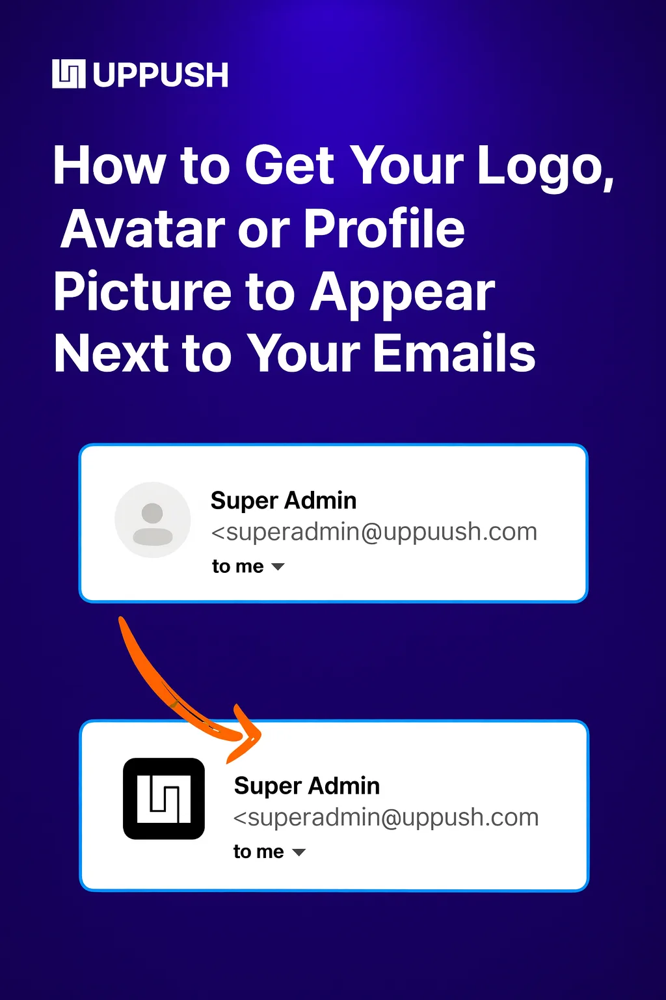

Whether your logo or profile image shows up next to your emails depends entirely on the recipient’s email client. Each inbox provider has its own rules and methods for displaying sender images.

In this article, we’ve outlined the different ways you can make your logo, avatar, or profile picture visible across the most popular email providers.

Keep in mind, troubleshooting this can be time-consuming and doesn’t affect email deliverability. If you’re new to email marketing, it may not be the best area to focus on right away. But for established senders, having your logo appear in the inbox can add a professional touch and strengthen your brand presence.

## Overview: all 4 methods

Here’s all the different methods you can use to get your logo/avatar to appear depending on the email client you’re targeting:

-   BIMI
-   Gravatar
-   Google Profiles
-   Outlook Profiles

Let’s go over each one in detail to see which is right for you. Typically doing a combination of a few will be the best route.

First, make sure you’re sending emails [_from your own domain_](https://docs.uppush.io/settings/verify-domain/), and that the sender identity you’re using is consistent.

## BIMI: best for big businesses

For larger companies, we recommend doing _[BIMI](https://en.wikipedia.org/wiki/Brand_Indicators_for_Message_Identification)_. While it has no affect on deliverability, it does guarantee your logo will show up next to your emails in most major email clients (except Outlook, which doesn’t recognize BIMI).

One big caveat. Gmail and Apple Mail require a Verified Mark Certificate (VMC) before they’ll show your logo. **This costs $1,500 per year, and needs to be purchased from a 3rd party vendor.**

So if you’re a solopreneur or startup (or if you mostly target Outlook users), it may not be worth your time.

Which major inbox providers support BIMI?

-   Gmail ($1,500/yr VMC required)
-   Apple Mail ($1,500/yr VMC required)
-   Fastmail
-   Yahoo Mail (except for Yahoo Japan)
-   Zoho

Setting up BIMI involves adding a DNS record to your domain, similar to DMARC.

## Gravatar: best for 3rd party email clients

Gravatar is an open API for associating an image with an email address. It’s free and has been around since 2004.

You can _[set up a gravatar here](https://gravatar.com/)_. It’s super easy and worth doing.

That said, none of the native email clients from Gmail, Outlook, Yahoo, or Apple Mail support gravatar.

Gravatar is mostly supported in popular 3rd party email clients like Superhuman, Thunderbird, Spark Mail, Airmail, Mimestream, etc. So if your subscribers have Gmail accounts but view their email using the Spark Mail app, they’ll see your Gravatar.

## Google Accounts: best for Gmail

So you don’t want to pay $1,500/yr for a VMC but still want your logo or Avatar to appear next to your emails in Gmail? There’s two ways to set this up.

**Option 1:** If you host the email for your domain with _[Google Workspace](https://workspace.google.com/)_, Gmail will show the profile picture on your email addresses to other Gmail or Google Workspace users. This is fairly easy.

**Option 2:** If you don’t pay for Google Workspace, there’s another workaround. It involves setting up a generic Google Account using your business email as the login.

You can follow _[this guide to do it](https://utechpia.com/how-to-add-an-email-profile-picture-to-any-domain-email-address/)_. We’ve heard this works _most_ of the time but is not as reliable as having a paid Google Workspace account.

## Microsoft 365 hosted email: best for Outlook

This is the only working method for Outlook.

If you host the email for your domain with Outlook, you can add an avatar to any email address in your workspace, and Outlook MIGHT show it, depending on which Outlook client your subscribers are using.

Here’s _[how to change your avatar on Outlook](https://support.microsoft.com/en-gb/office/change-your-profile-photo-or-name-in-outlook-com-fb6a40cf-0dc8-4ee8-95ae-fa506586f120)_.

If you don’t host your email with Microsoft, you cannot get your logo to appear in Outlook.
