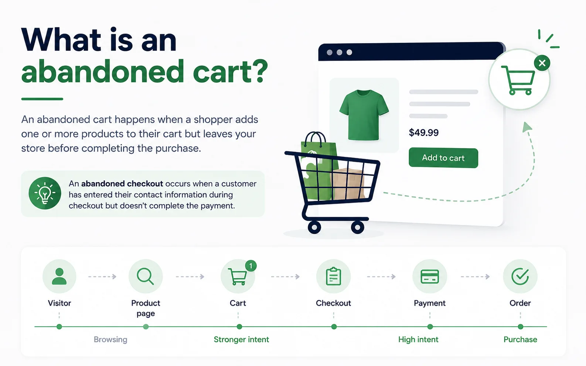

Imagine this.

A customer finds your store through Google or Instagram. They browse a few products, read the descriptions, compare different options, and finally add an item to their cart. For a moment, it looks like you’ve won a new customer. Then… they leave.

No purchase.  
No payment.  
No order.

If you’ve been running a Shopify store for a while, you’ve probably seen this happen hundreds or even thousands of times. At first, it can feel frustrating. You spend time creating products, writing descriptions, improving your store, and even paying for ads to bring visitors in. Yet many shoppers disappear just before completing their purchase.

The good news is that an abandoned cart doesn’t always mean a lost customer. In many cases, shoppers simply need a reminder, more information, or a little more confidence before they’re ready to buy. That’s exactly why abandoned cart recovery has become one of the most valuable marketing strategies for Shopify stores.

Instead of focusing only on getting more traffic, you can recover sales that were already close to happening. In this guide, you’ll learn why shoppers abandon their carts, how Shopify handles abandoned checkouts, and the most effective ways to bring customers back and turn missed opportunities into completed orders.

* * *

## All about abandoned cart

### What is an abandoned cart?

An abandoned cart happens when a shopper adds one or more products to their shopping cart but leaves your store before completing the purchase. It doesn’t matter whether they planned to come back later or simply changed their mind – the order was never completed.

For online stores, this is completely normal. In fact, very few customers buy the first product they look at without thinking. Some compare prices. Some open several tabs. Some get interrupted by a phone call. Others decide to wait until payday. An abandoned cart simply means the shopping journey stopped before reaching the finish line.

Shopify also uses the term **abandoned checkout**, which is slightly different.

An abandoned checkout occurs after a customer has already entered their contact information during checkout but doesn’t complete the payment. Shopify considers the checkout abandoned if it remains incomplete for more than 10 minutes after the customer provides their email address. This distinction is important because a customer who reaches checkout has usually shown stronger buying intent than someone who only added products to a cart.

For Shopify merchants, abandoned checkout recovery is available for the **Online Store** and **Buy Button** sales channels. Recovery emails aren’t sent for abandoned checkouts created through Shopify POS or most third-party sales channels. Shopify also won’t send recovery emails in certain situations, such as when payment processing fails, inventory becomes unavailable, or the customer enters only a phone number instead of an email address.

Although “abandoned cart” and “abandoned checkout” are often used interchangeably, they represent different stages of the buying journey. You can think of it like this:

**Visitor → Product page → Cart → Checkout → Payment → Order**

The closer someone gets to completing checkout, the stronger their purchase intent becomes. That also means your recovery strategy should become more personalized as shoppers move through each stage.

* * *

### Why shoppers abandon their carts

One of the biggest mistakes merchants make is assuming that abandoned carts happen because customers weren’t interested. In reality, that’s often the opposite. Adding something to a cart is one of the strongest buying signals a customer can give. They’ve already decided that your product is worth considering. Something else prevented the purchase from happening. Understanding that “something else” is the first step toward recovering more sales.

#### They weren’t ready to buy yet

This is probably the most common reason. Online shopping isn’t always a straight path from product page to payment. Many people use their cart almost like a wishlist. They add products while researching different options, compare prices across multiple stores, or simply save items so they can think about them later. This doesn’t necessarily mean you’ve lost the sale. It simply means the customer needs more time. A gentle reminder later that day or the following morning is often enough to bring them back.

* * *

#### Unexpected costs appear at checkout

Nothing frustrates shoppers more than seeing the total price suddenly increase. It might be shipping fees, taxes or additional charges. If those costs appear only at the final step, customers may hesitate or leave to compare alternatives. Even if they eventually come back, the interruption gives competitors another opportunity to win the sale. Being transparent about shipping costs and delivery times early in the shopping journey helps reduce this problem.

* * *

#### The checkout process feels too complicated

Every extra step creates another opportunity for customers to leave. It could be long forms, mandatory account creation, too many pages, limited payment methods. A checkout should feel effortless. If customers have to stop and think about how to complete their purchase, some of them won’t.

That’s why Shopify’s checkout is designed to remove as much friction as possible. As a merchant, it’s worth reviewing your own checkout experience regularly and asking yourself one simple question: _“Would I enjoy buying from this store?”_

* * *

#### Customers still have questions

Sometimes shoppers simply aren’t convinced yet. They might wonder:

-   How long will shipping take?
-   Can I return the product?
-   Is the quality really as good as it looks?
-   What if the size doesn’t fit?
-   Is this store trustworthy?

These questions often appear right before payment. If customers can’t quickly find the answers, many choose the safest option: They leave. This is one reason product reviews, FAQs, clear shipping policies, and return information have such a big impact on conversion rates.

* * *

#### Payment problems interrupt the purchase

Not every abandoned checkout is a customer decision. Sometimes the payment simply fails. Shopify records payment events for abandoned checkouts, making it easier to identify issues such as:

-   Declined cards
-   Incorrect card details
-   Failed 3D Secure authentication
-   Expired cards
-   ZIP or billing address mismatches
-   Technical payment errors

In these situations, the customer may still want the product—they just couldn’t complete the transaction. Reviewing payment events inside Shopify can help merchants identify patterns and assist customers who contact support after experiencing payment issues.

* * *

#### They got distracted

Real life happens. A lot of situation can happen. Someone starts shopping during lunch. Their child needs attention. A meeting begins. Their phone battery dies. The package arrives at the front door. Not every abandoned cart represents hesitation. Sometimes customers simply forget.

These shoppers are often the easiest to recover because they already intended to buy. A well-timed reminder can bring them back before they even start shopping somewhere else.

* * *

#### They wanted to compare other stores

Online shopping has made comparison easier than ever. Within minutes, shoppers can compare prices, shipping times, customer reviews, and promotions across several stores. This doesn’t automatically mean you need to offer the lowest price.

Customers also compare trust, better reviews, faster delivery, more flexible returns, higher-quality product photos and a stronger brand. All of these factors influence whether shoppers return to complete their purchase.

* * *

### Why recovering abandoned carts matters

Many Shopify merchants immediately think about getting more visitors when sales slow down. There many ways to do it: run more ads, post more content, increase traffic. While attracting new visitors is important, it is often the most expensive way to grow. Recovering abandoned carts works differently.

Instead of trying to convince someone who has never heard of your business, you’re reconnecting with a shopper who has already:

-   Found your store.
-   Viewed your products.
-   Added something to their cart.
-   Considered making a purchase.

In other words, they’ve already completed much of the buying journey. That’s what makes abandoned cart recovery one of the highest-return marketing activities for ecommerce businesses. Every recovered order improves the value of traffic you’ve already paid to acquire.

Imagine spending $500 on advertising. Without any recovery strategy, many interested shoppers leave forever. With effective recovery emails, web push notifications, or follow-up automations, some of those shoppers return and complete their purchases.

The advertising cost hasn’t changed. But the revenue generated from that traffic increases. Over time, that improvement compounds. It also creates a better customer experience. Think about your own shopping habits.

Have you ever appreciated receiving a reminder about something you genuinely intended to buy? Probably. The key is relevance. Recovery messages shouldn’t pressure customers. They should help them continue a shopping journey they already started. When done well, abandoned cart recovery doesn’t feel like marketing. It feels like good customer service.

## 10 proven strategies to recover abandoned carts on Shopify

Recovering abandoned carts isn’t about convincing every visitor to buy. It’s about helping interested shoppers continue a purchase they were already close to making. A good recovery strategy feels helpful, not pushy.

The best Shopify stores don’t rely on a single tactic. They combine email, web push notifications, checkout optimization, trust signals, and automation to reconnect with shoppers at the right time. Here are ten proven strategies you can start using today.

* * *

### 1\. Send an abandoned cart email while the purchase is still fresh

Timing matters. If you wait several days before sending a reminder, the customer may have already bought from another store—or forgotten about your product completely.

A simple reminder within the first few hours is often enough to bring shoppers back. At this stage, don’t rush to offer a discount. Your goal is simply to remind them what they left behind and make it easy to continue checkout.

A good abandoned cart email should include the product image, product name, a clear call-to-action, and a direct link back to the customer’s cart. The fewer clicks it takes to finish the purchase, the better.

* * *

### 2\. Build a recovery email sequence instead of sending only one email

Not every customer responds to the first reminder. Some need a little more time before making a decision.

Instead of sending a single email, create a short sequence. The first email reminds shoppers about their cart, the second answers common concerns such as shipping or returns, and the final email can include a limited-time incentive if it makes sense for your business.

This approach feels more natural than sending one aggressive sales email and gives customers multiple opportunities to come back.

* * *

### 3\. Combine email with web push notifications

Email is one of the most effective recovery channels, but customers don’t always check their inbox immediately.

Web push notifications add another touchpoint. A short notification like **“Your cart is waiting”** can quickly catch a shopper’s attention, while the follow-up email provides more details and encourages them to complete the purchase.

Using both channels together creates more opportunities to recover the sale without overwhelming the customer. Uppush allows Shopify merchants to automate both email and web push recovery from the same workflow.

* * *

### 4\. Show trust before asking customers to buy

Sometimes shoppers abandon their carts because they’re still unsure about your store, not because they dislike your products.

Your recovery emails should answer the questions customers are already asking. Include customer reviews, money-back guarantees, return policies, secure payment information, or shipping details to remove hesitation. Building trust is often more effective than offering another discount.

* * *

### 5\. Make returning to checkout effortless

Every extra click gives shoppers another chance to leave.

Recovery emails and notifications should send customers directly back to their checkout whenever possible, not just to your homepage or a category page. They shouldn’t have to search for the same product again. Shopify’s abandoned checkout links are designed to make this process simple by allowing customers to continue where they left off.

* * *

### 6\. Fix the problems that caused customers to leave

Recovery messages are important, but preventing abandonment is even better.

Review your checkout experience regularly. Look for unexpected shipping fees, slow page loading, complicated forms, missing payment options, or confusing checkout steps. Even small improvements can reduce the number of abandoned carts before recovery emails are ever needed.

Shopify also lets merchants review abandoned checkouts and payment events, helping identify patterns such as declined cards, payment failures, or inventory issues.

* * *

### 7\. Personalize your recovery messages

Generic emails are easy to ignore. Instead of saying **“You left something behind,”** remind shoppers exactly what they were interested in. Show the product they viewed, include its image, and mention any relevant details such as color or size.Personalized messages feel much more relevant because they continue the shopping journey instead of starting a new conversation.

* * *

### 8\. Create urgency—but use it carefully

Urgency can encourage customers to make a decision, but only when it’s genuine. For example, if a promotion ends tonight or inventory is running low, it’s reasonable to let shoppers know. On the other hand, fake countdown timers or repeated “last chance” emails quickly lose credibility.

Customers respond better when urgency reflects a real situation rather than a marketing tactic.

* * *

### 9\. Continue the conversation even after the cart is gone

Not every shopper reaches the cart before leaving. Some visitors spend several minutes looking at the same product but never add it to their basket. Others leave after discovering that an item is out of stock or slightly above their budget.

Browse abandonment, back-in-stock alerts, and price-drop notifications give you additional ways to reconnect with these shoppers. Instead of waiting for a cart to be abandoned, you’re responding to buying signals throughout the entire customer journey.

* * *

### 10\. Automate your recovery strategy

Manually following up with every shopper isn’t realistic as your business grows. Automation ensures every customer receives the right message at the right time without adding extra work to your day. Once your workflows are in place, they continue recovering sales in the background while you focus on running your store.

With Uppush, Shopify merchants can automate abandoned cart emails, checkout recovery, browse abandonment, back-in-stock alerts, price-drop notifications, and web push campaigns from one platform, creating a complete recovery system instead of relying on individual campaigns.

* * *

## Recovery starts long before the reminder

Many merchants think abandoned cart recovery begins after a customer leaves. In reality, it starts much earlier.

A fast store, a simple checkout, clear shipping information, trustworthy reviews, and relevant follow-up messages all work together to reduce abandonment and recover more sales. Recovery isn’t one email or one notification—it’s an entire customer experience designed to help shoppers finish what they already started.

### Build an abandoned cart email sequence that converts

Sending one reminder email is better than sending nothing at all, but it isn’t always enough. Some shoppers are ready to buy after a gentle reminder, while others need more reassurance before making a decision. A short email sequence gives you multiple opportunities to reconnect without overwhelming your customers. A simple three-email workflow is enough for most Shopify stores.

#### Email 1: Send a friendly reminder

The first email should be sent within a few hours after the customer leaves your store. At this point, the purchase is still fresh in their mind, so there’s no need to offer a discount. Simply remind them about the products they left behind and include a clear button that takes them back to checkout. Keep the message short and helpful. The goal is to remove friction, not create pressure.

#### Email 2: Build confidence

If the customer hasn’t returned after the first reminder, the second email should focus on answering questions that may be preventing the purchase.

This is a good place to highlight customer reviews, shipping information, return policies, secure payment options, or your satisfaction guarantee. These trust signals can make a big difference for first-time buyers who are still deciding whether they feel comfortable ordering from your store.

#### Email 3: Give shoppers one last reason to come back

The final email can include a limited-time incentive if it fits your pricing strategy. This could be free shipping, a small discount, or simply a reminder that the items may sell out soon. Avoid training customers to expect discounts every time they abandon their carts. Incentives should support your recovery strategy, not replace it.

* * *

## Why web push notifications make cart recovery even stronger

Email is one of the most effective recovery channels, but it has one limitation—people don’t always check their inbox right away.

Web push notifications help solve this problem by reaching shoppers directly through their browser, even after they’ve left your website. A short message such as **“Your cart is waiting”** or **“Complete your order before your items sell out”** can bring customers back with a single click.

Using email and web push together creates a more complete recovery strategy. Push notifications capture immediate attention, while emails provide additional details, product information, and reassurance. Rather than relying on one communication channel, you’re giving customers multiple opportunities to continue their purchase in the way that’s most convenient for them.

* * *

## Common mistakes to avoid

Even the best recovery tools won’t perform well if the overall experience isn’t customer-friendly. Here are a few common mistakes that can reduce your recovery rate.

### Waiting too long to follow up

If your first reminder arrives several days after the customer leaves, they may have already purchased elsewhere or forgotten about your store. Sending your first message while the shopping experience is still fresh usually leads to better results.

### Sending too many emails

Following up is important, but excessive reminders can have the opposite effect. Customers who receive too many emails may ignore future campaigns or unsubscribe altogether. A short, well-planned sequence is usually more effective than repeated daily reminders.

### Offering discounts too quickly

Many merchants immediately send a coupon in their first recovery email. While discounts can increase conversions, using them too early may encourage shoppers to abandon their carts intentionally in hopes of receiving another offer.

Try reminding customers first, then introduce incentives only if they’re truly needed.

### Ignoring the checkout experience

Recovery emails can’t fix a checkout that’s confusing or difficult to use. If customers consistently leave because of unexpected shipping costs, missing payment methods, or slow page loading, improving the checkout experience should be your first priority.

### Forgetting to measure results

Recovery campaigns should continue improving over time. If you never review their performance, you’ll miss opportunities to optimize your timing, messaging, and automation.

* * *

## How to measure the success of your recovery strategy

Recovering abandoned carts isn’t just about sending emails—it’s about understanding what actually brings customers back.

Start by tracking your recovery rate, which shows how many abandoned carts eventually become completed orders. If this number improves over time, your recovery strategy is moving in the right direction.

Next, look at email performance. Open rates tell you whether your subject lines attract attention, while click-through rates show whether customers are interested enough to return to your store. Finally, monitor how many recovered orders generate actual revenue. This is the metric that matters most because it reflects the real business impact of your campaigns.

If you’re using Shopify, you can also review the **Abandoned checkouts** section to identify payment failures, checkout issues, and recovery status. Shopify’s reporting helps you understand whether customers completed their purchases after receiving a recovery email and provides insights that can guide future improvements.

* * *

## Final thoughts

Abandoned carts are part of running an ecommerce business. No matter what you sell, some shoppers will leave before completing their purchase. The important thing is not to see those visitors as lost customers. Many of them were already interested in buying—they simply needed a reminder, more confidence, or a better shopping experience to finish the journey.

A successful recovery strategy combines several elements: a smooth checkout process, well-timed abandoned cart emails, web push notifications, trust-building content, and automation that keeps working in the background. Together, these small improvements can recover revenue that would otherwise be lost.

If you’re looking for an easier way to automate abandoned cart recovery on Shopify, [Uppush](https://apps.shopify.com/pushup-notification-marketing?st_source=uppush_web&st_position=blog_post_body) helps you create recovery emails, web push notifications, browse abandonment workflows, back-in-stock alerts, price-drop campaigns, and other automated customer journeys from a single platform. Instead of manually following up with every shopper, you can build workflows that recover sales around the clock while you focus on growing your business.
