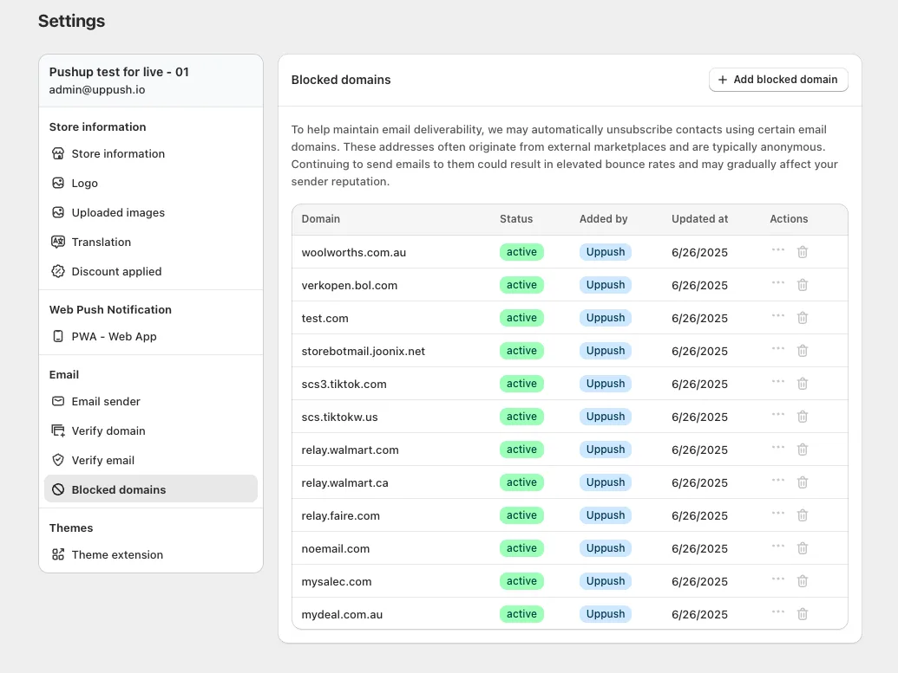

Maintaining high email deliverability is crucial to the long-term success of your marketing efforts. One overlooked but important part of this is managing the types of email addresses you allow into your contact list — especially when it comes to suspicious or low-quality domains.

That’s where Uppush’s **Blocked domains** feature comes in.

## **Why Blocking Email Domains Matters**

Certain email domains are known for generating spammy or anonymous contacts. These often come from external marketplaces or bulk-signup tools and are associated with low engagement, high bounce rates, or spam traps.

Continuing to email these types of addresses can slowly damage your sender reputation and reduce the chances of your messages reaching real customers’ inboxes.

To help prevent that, Uppush now gives you a way to automatically block or unsubscribe contacts using specific email domains — so you stay in control of your list quality.

## **How the Blocked Domains Feature Works**

You can find this feature in the **Settings** tab under **Blocked domains**.

Uppush comes with a **preloaded list of commonly abused domains** known for spam or fake signups. These might include domains from disposable email providers, bots, or anonymous email services.

In addition, you can:

-   **Add your own domains** to the blocklist
-   **Remove** or **temporarily deactivate blocking** for your added domains if you want to allow them
-   **Review and manage** the list at any time

When a subscriber attempts to sign up using an email address from a blocked domain, Uppush will automatically prevent them from being added to your contact list — or unsubscribe them if they already exist.

## **What Counts as a Suspicious Domain?**

Examples of domains you might want to block include:

-   Disposable or temporary email providers (e.g. `mailinator.com`, `tempmail.com`)
-   Domains known to generate fake Shopify orders
-   Certain reseller or marketplace platforms where email addresses don’t represent real buyers

If you see unusual patterns in your subscriber list, or notice high bounce rates, it may be worth reviewing your blocked domains list.

## **How This Helps Your Deliverability**

By filtering out low-quality or anonymous addresses, you’re reducing the chances of:

-   High bounce rates
-   Spam complaints
-   Poor engagement metrics

All of which are factors that email providers like Gmail and Yahoo use to determine if your messages should land in the inbox or be filtered as spam.

Think of blocked domains as a quiet, behind-the-scenes way to protect your reputation.

## **Need Help?**

The blocked domains feature is turned on by default with our recommended list. But you can always add more to the list and fine-tune it based on your store’s experience.

If you’re unsure whether to block a specific domain or want to learn more about improving your deliverability, [reach out to our support team](https://uppush.io) — we’re here to help.
