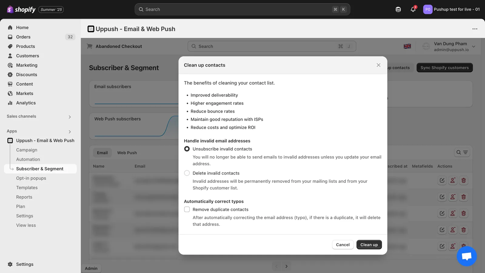
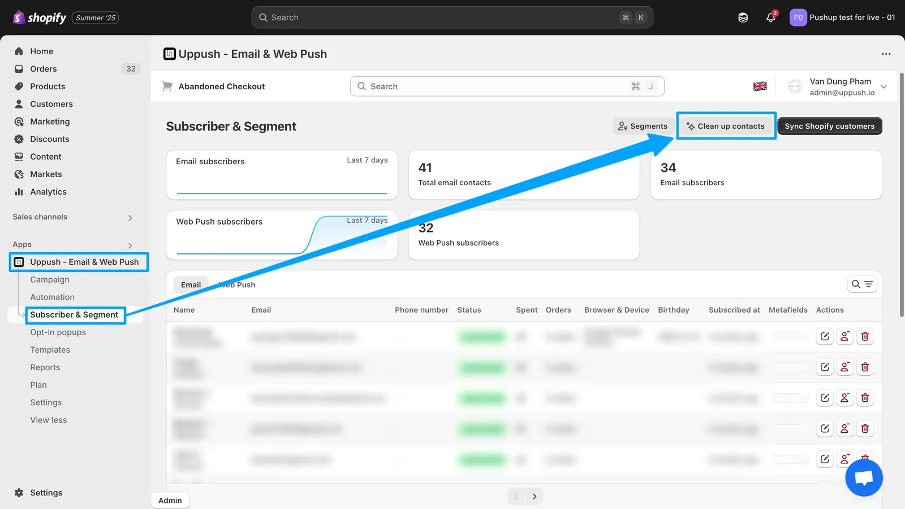

Email list cleaning, or **Clean up contacts**, is a powerful way to keep your campaigns performing at their best. By removing invalid, disposable, or inactive addresses from your subscriber list, you’ll:

-   **Protect deliverability**: Fewer bounces and spam complaints mean inbox providers like Gmail and Yahoo continue to trust your send-outs.
-   **Boost engagement**: A leaner list of real, interested subscribers drives higher open and click rates.
-   **Lower costs**: You won’t waste emails—or opportunities—on addresses that were never going to convert.
-   **Maintain reputation**: Avoid spam traps and hard bounces that can erode your sender score over time.

To support your growth, Uppush now includes a built-in Clean up contacts feature—available exclusively for Pro plan users—at just **$0.5 per 100 contacts**. This helps you maintain a healthy, high-performing list and improve your email deliverability.

\*\*\* Please note: there is a **minimum charge of $0.5 per clean-up**.  
This minimum fee helps us cover the infrastructure and processing cost to ensure fast and accurate cleaning results.

The **Clean up contacts** feature in Uppush

## **What Email List Cleaning Does**

Within Uppush, the cleaning tool helps you deal with invalid or risky email addresses in a few ways:

-   **Scan your contact list** for:
    -   Invalid or unreachable email addresses
    -   Disposable or temporary domains
    -   Common typo-based domains (e.g. `gmal.com`)
    -   Duplicate contacts
-   Choose how to handle invalid contacts:
    -   **Unsubscribe invalid contacts** – These contacts will remain in your list, but won’t receive future emails unless their address is updated.
    -   **Delete invalid contacts** – Permanently removes them from both your Uppush list and your Shopify customer list.
-   **Automatically correct common typos** (e.g. fixing `gmial.com` to `gmail.com`).
-   **Optionally remove duplicates** after typo correction to avoid sending to the same contact twice.

After cleanup, your subscriber count will update, and unsubscribed contacts won’t be billed or emailed moving forward. Any removed contacts will also be excluded from your future campaigns and automations.

### **When to Run a Cleanup**

While exact cadence depends on your store and volume, common best practices include:

-   **Before major campaigns** or promotions.
-   **Quarterly or bi-annually** for most stores.
-   **Any time you see** rising bounce rates or falling engagement.

Regular cleaning helps you catch problems early and preserve long-term performance.

> **Where to Find It**
> 
> You can access this feature by going to:  
> **Subscriber & Segment → Clean up contacts** in your Uppush dashboard.  
> (Available on the **Pro plan**.)

To find the feature, go to the Uppush app > Subscriber & Segment > Clean up contacts

## **Next Steps**

When you’re ready to clean up your list and sharpen your deliverability, you’ll find everything you need inside Uppush. If you have questions about how it works or want help reviewing your results, feel free to reach out to our support team anytime.
