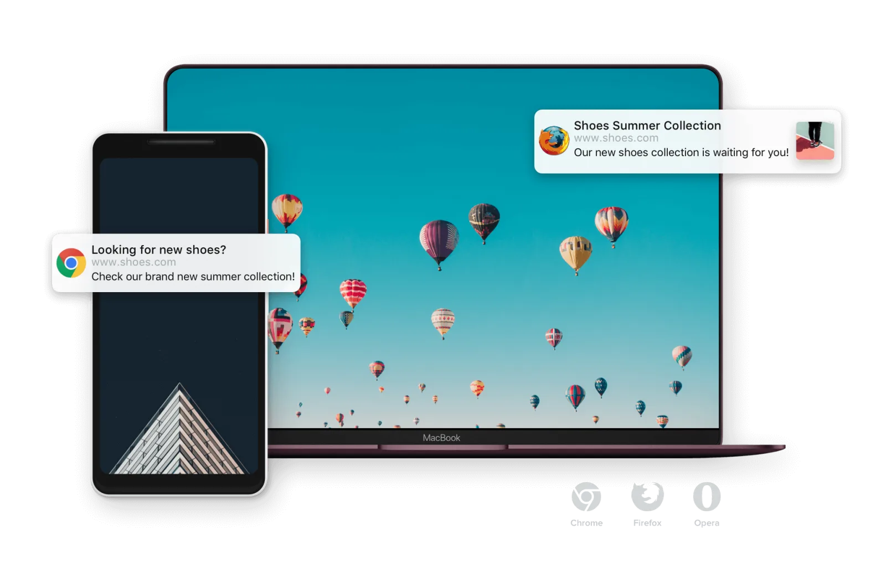
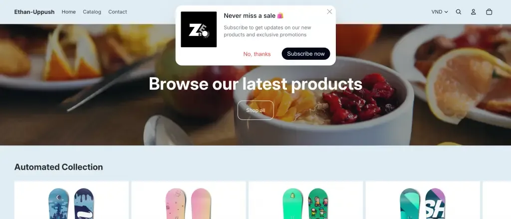
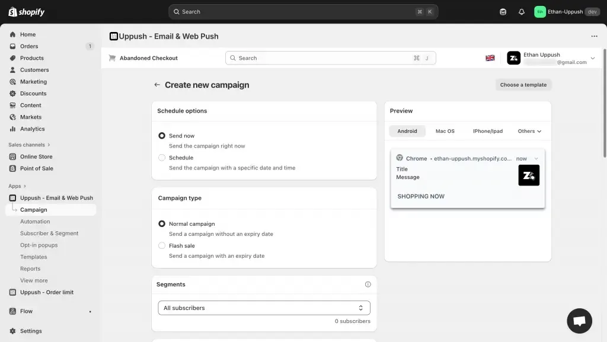
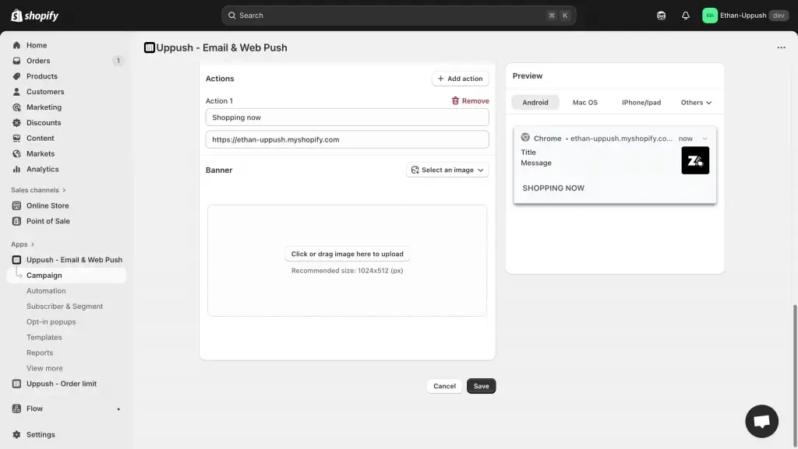
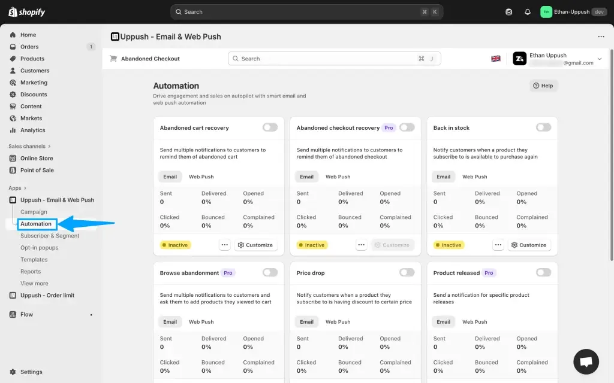

Most store visitors don’t buy on their first visit — they browse, get distracted, and leave. But what if you could reach them again instantly, without needing their email or phone number?

That’s exactly what **Web Push Notifications** do. With Uppush, you can start sending web push notifications for free — up to **500 per month** on the Free plan.

## What Are Web Push Notifications?

Web push notifications are small _clickable messages that appear right on a shopper’s browser_ — even when they’re not on your website. They can show up on desktop or mobile devices, just like an app notification.

Browser-based web notifications work on both Desktop and Mobile

When a visitor opts in to receive updates, you can send them news, offers, and reminders directly through their browser. No forms, no emails — just one click and they’re subscribed.

Customers can subscribe to Web Push notifications quickly with just a click!

## Why Use Web Push Notifications?

They’re one of the most effective tools for bringing visitors back to your store. Here’s why:

-   **Instant reach:** Your messages appear right on your customers’ screens, grabbing attention fast.
-   **Higher engagement:** Push notifications have significantly higher click rates than emails.
-   **Zero cost to start:** Uppush’s Free plan includes **500 web push notifications per month**, which is enough for most small stores to get started.
-   **Simple setup:** No coding, no integrations — just enable, customize, and send.

Many Shopify stores use them to recover abandoned carts, announce sales, or share new arrivals. You can even automate these messages so they send automatically based on customer behavior.

## Getting Started

To set up your first campaign, open your Uppush dashboard and go to **Campaigns → New Campaign **→** Web Push Campaign**.

1.  Choose a **template**, pick either **Send now** or **Schedule**.
2.  Select a **Campaign type** and a **Segment** of customers to send to.
3.  Include a **link** and a **custom banner** if you like, then finally click **Save** and you’re done.

Creating a new Web Push campaign

Finalize your setup for the Web Push campaign

If you’d rather let it run automatically, check out Uppush’s **Automation** tab — you can create triggers for events like abandoned carts or new product updates.

Check out the Automation tab to set up various triggers for your Web Push notifications

Want to grow your audience even faster? Combine push notifications with **[Email Popups](/grow-your-list-with-free-email-popups/)** to collect emails, or set up **[Email Automations](https://docs.uppush.io/popup-and-automation/how-to-enable-automations/welcome-notifications)** to send personalized follow-ups.

> Start using web push notifications for free — [**Install Uppush on Shopify**](https://apps.shopify.com/pushup-notification-marketing?st_source=uppush_web&st_position=blog_post_body).
