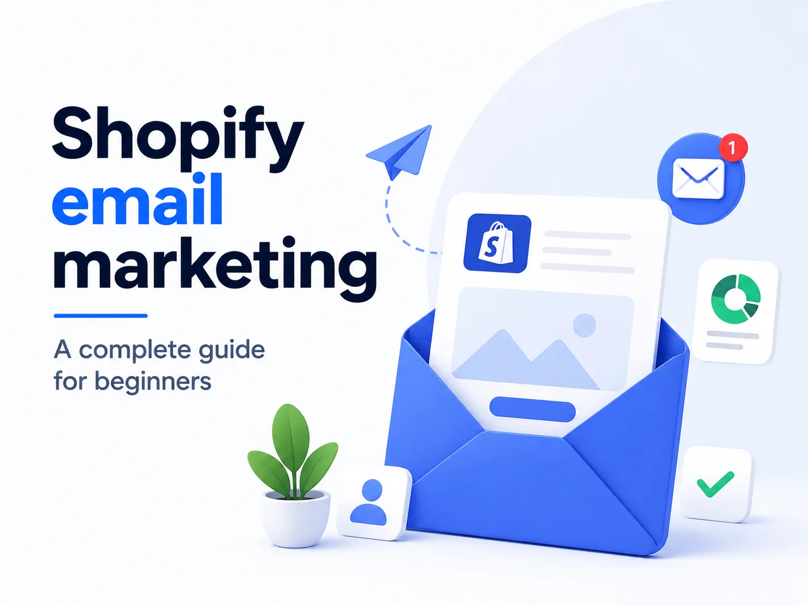

Getting people to visit your Shopify store is one thing. Getting them to come back and eventually buy is another. A shopper might discover your store through an Instagram post, click an ad, browse a few products, and leave. Maybe they weren’t ready to buy. Maybe they wanted to compare prices. Or maybe they simply got distracted.

If that visitor leaves without giving you a way to contact them, the relationship usually ends there. You may even have to pay for another ad just to reach the same person again. Email marketing changes that.

Once shoppers subscribe to your emails, you have a direct way to continue the conversation. You can introduce your brand, recommend products, remind them about an abandoned cart, tell them when an item is back in stock, or simply give them a reason to return.

For Shopify stores, especially smaller ones, this makes email much more than a channel for sending newsletters. Used well, it can become a system that helps turn first-time visitors into customers and existing customers into repeat buyers. And getting started is much simpler than it may seem.

## What does Shopify email marketing actually mean?

At its simplest, Shopify email marketing means using email to communicate with people who have interacted with your store. Some of those emails are campaigns that you decide to send. If you’re launching a summer collection next Friday, for example, you might send an announcement to your subscribers that morning.

Other emails happen automatically because a customer did something. Imagine Sarah visits your Shopify store and signs up for a 10% welcome discount. She immediately receives an email with her code. Later, she looks at a pair of shoes and adds them to her cart but doesn’t finish the purchase. A few hours later, she receives a reminder showing the shoes she left behind.

A week after buying them, she receives another email introducing products that complement her purchase. None of these messages need to be sent manually. That’s where email marketing becomes particularly useful for Shopify stores. Instead of constantly deciding who needs which message, you can create customer journeys once and let them respond automatically to what shoppers do.

## Your email strategy starts before the first email

It’s tempting to begin by designing a beautiful newsletter. But before you can send anything, you need an audience.

For most Shopify stores, that means finding ways to turn website visitors into subscribers. A simple popup is often enough to get started. But asking someone to “Subscribe to our newsletter” isn’t particularly exciting. Most shoppers already have crowded inboxes, so they need a reason to give you their email.

That reason doesn’t always have to be a huge discount. It might be 10% off their first purchase, free shipping, early access to a new collection, useful content, or the chance to hear when an unavailable product comes back in stock. The important part is the exchange of value. You’re essentially saying:

**Give us a way to stay in touch, and we’ll give you something useful in return.**

For stores where discounts fit the brand, an interactive spin-to-win popup can make this process more engaging. A visitor enters their email, spins for a reward, and perhaps receives 5% off, 10% off, free shipping, or another incentive.

Tools such as Uppush allow Shopify merchants to create both regular subscription popups and spin wheels, then connect those new subscribers directly to their marketing automations. But collecting the email is only the beginning. What happens immediately afterward matters just as much.

## Your first automation should probably be a welcome series

Think about the moment someone subscribes. They’ve just visited your store, looked at your products, and voluntarily asked to hear from you. Their interest is high. Yet many stores collect that email address and then do nothing until their next promotional campaign several days or even weeks later.

A welcome email solves this. If you promised a discount, the first email should deliver it immediately. Don’t hide the code halfway down a long brand story. Give customers what they signed up for. Then use the next few emails to help them understand why they should shop with you.

For example, your first email might simply say:

> **Welcome! Here’s your 10% discount.**
> 
> Thanks for joining us. Use WELCOME10 on your first order.
> 
> **Shop now →**

A second email a day or two later could introduce your best-selling products or explain what makes your brand different. A third could show customer reviews, answer common questions, or remind subscribers that their welcome offer is still available. You don’t need a ten-email welcome sequence.

For a beginner, two or three useful emails are often a much better starting point. The goal isn’t to send as much as possible. It’s to help a new subscriber take the next natural step toward becoming a customer.

## Not every interested shopper buys immediately

Now imagine a different situation. Someone finds a product they really like. They read the description, look through the photos, choose a size, and add it to their cart. Then they disappear.

It can feel like a lost sale, but it isn’t necessarily one. People abandon carts for all kinds of reasons. They get distracted. They want to compare another product. They aren’t sure about shipping. They decide to think about it overnight.

The important thing is that adding something to a cart is a strong signal of interest. Instead of letting that signal disappear, email automation gives you another chance to continue the conversation. Your first abandoned cart email doesn’t need to offer a discount.

A simple:

> **Still thinking it over?**

followed by the product they left behind and a button returning them to their cart may be enough.

If they still don’t purchase, a later email could answer common concerns about shipping, returns, sizing, guarantees, or product quality. Only after that might you consider an incentive if discounts make sense for your business. This is also why automation should be connected to actual Shopify behavior. Once the shopper completes the purchase, the recovery sequence should stop.

Sending “You forgot something” after someone has already paid isn’t just unnecessary. It makes your marketing feel disconnected from the customer. Uppush, for example, can use Shopify shopping behavior to automate abandoned cart and checkout recovery and stop the recovery journey once the customer converts.

## A cart isn’t the only sign of interest

Some shoppers never reach the cart. They might view the same product two or three times, check different variants, and then leave. That’s weaker intent than adding something to a cart, but it’s still intent. This is where browse abandonment can help.

Instead of sending an aggressive sales message, you might simply remind the shopper of what they were looking at:

> **Still interested?**
> 
> Take another look at the product you recently viewed.
> 
> **View product →**

The difference in tone matters. Someone who abandoned a checkout was very close to purchasing. Someone who viewed a product once may only be curious. Good email marketing recognizes that difference. Rather than blasting the same message to everyone, it responds to where people actually are in their shopping journey.

## Sometimes the product, not the shopper, is the reason a sale doesn’t happen

Imagine that someone is ready to buy, but the product they want is sold out. There’s nothing an abandoned cart email can do about that. What you can do is give the shopper a way to say:

**Tell me when it’s available again.**

When inventory returns, a back-in-stock email can automatically bring that shopper back. These emails can be extremely simple because there’s already clear product interest.

> **It’s back in stock**
> 
> The product you’ve been waiting for is available again.
> 
> **Shop now →**

Price-drop emails work in a similar way. A shopper may like a product but decide the current price is too high. If that product later goes on sale, telling an interested shopper about the change is much more relevant than announcing the discount to your entire database.

Both back-in-stock and price-drop notifications are examples of an important idea:

**The best marketing messages often come from customer behavior, not your marketing calendar.**

Uppush supports both types of automation through email and web push, allowing merchants to reconnect with shoppers when something meaningful changes.

## As your list grows, stop treating everyone the same

When you have 100 subscribers, sending one newsletter to everyone might be fine. When you have 10,000, it starts to become a problem. Your subscribers aren’t all the same.

Some have never purchased. Some bought yesterday. Some have ordered five times. Some are interested in one product category but never look at another. Others haven’t interacted with your store for months. Yet many businesses continue sending exactly the same campaign to all of them.

That’s where segmentation comes in. Segmentation sounds technical, but the idea is simple: **send people messages that make sense for them.** A new subscriber might need help choosing their first product. A repeat customer doesn’t need another “Welcome to our brand” message.

Someone who regularly buys skincare probably cares more about your new moisturizer than your new collection of phone accessories. And someone who hasn’t opened an email for six months may need a re-engagement message rather than another weekly promotion.

You don’t need dozens of complicated segments when you’re starting out. Even separating subscribers into groups such as new subscribers, customers, repeat customers, and inactive subscribers can make your campaigns much more relevant.

## Don’t make every email a discount

Once stores discover that promotional emails can generate sales, there’s a temptation to turn every campaign into:

**20% OFF!**

Then:

**FLASH SALE!**

Then:

**LAST CHANCE!**

And another “last chance” three days later.

Discounts work, but if they’re the only reason you communicate with customers, people quickly learn to ignore your regular prices and wait for the next promotion. Your email calendar should give subscribers other reasons to open.

A fashion store could send a guide on how to style a new collection.

A skincare brand could explain how to build a simple evening routine.

A coffee store could show different brewing methods.

You can also introduce new products, tell the story behind a collection, feature customer favorites, share reviews, recommend complementary products, or show customers how to get more value from something they already bought. This is where email becomes more than a sales tool.

You’re building a relationship between purchases rather than appearing in someone’s inbox only when you want them to spend money.

## Keep the emails themselves simple

You don’t need to design every campaign like a magazine. In ecommerce, a simple email with one clear message is often easier to understand. Suppose you’re launching a new collection.

The email might need only a strong headline, a short introduction, a product image, one or two benefits, and a clear **Shop the collection** button.

That’s it.

The same applies to subject lines. Don’t try so hard to be clever that customers can’t tell what the email is about.

“The item you wanted is back” clearly explains a back-in-stock message.

“Still thinking it over?” works naturally for cart recovery.

“Meet our summer collection” tells the reader exactly what they’ll find inside.

Clear communication usually beats unnecessary complexity.

## Email campaigns and automation should work together

One of the easiest ways to understand Shopify email marketing is to separate it into two parts.

**Campaigns create moments. Automation responds to moments.**

You launch a Black Friday sale, so you send a campaign. A shopper abandons their Black Friday cart, so an automation follows up.

You launch a new product, so you send a campaign. A customer views that product several times but doesn’t buy, so an automation may bring them back.

Someone signs up during the launch, so a welcome automation starts.

These aren’t separate strategies. They support each other.

Campaigns allow your brand to start conversations. Automation makes sure those conversations don’t simply end when customers leave your website.

## Email doesn’t have to work alone

Email is powerful, but it has one obvious limitation: the customer needs to check their inbox. That’s one reason web push can complement it. Web push notifications appear through the browser and can deliver much shorter, more immediate messages. Imagine a shopper abandons a cart.

A web push notification could provide the quick reminder:

> **Your cart is waiting 👀**

while the email provides more context: the product image, benefits, reviews, shipping information, or an offer.

The same approach works particularly well for time-sensitive events.

When a popular product returns to stock, web push can alert the shopper immediately while email gives them the full product information.

When a flash sale starts, push can create urgency while email explains the promotion.

This doesn’t mean sending every message twice. The goal is to decide which channel fits the moment. Uppush combines email and web push in one Shopify marketing platform, so stores can use both channels within the same customer journey rather than managing them separately.

## How do you know whether your email marketing is working?

It’s easy to become obsessed with open rates. A 45% open rate looks better than 30%, so it feels like the campaign was successful. But opens don’t pay the bills.

For ecommerce, the more useful question is what happened **after** the email was opened.

Did people click?

Did they return to your store?

Did they add something to their cart?

Did they purchase?

How much revenue did the email generate?

You should still monitor opens, clicks, unsubscribes, and bounces because they tell you whether people are engaging with your messages. But eventually you want to understand the entire journey:

**Email → Click → Store visit → Purchase → Revenue**

For example, one campaign might have a lower open rate but generate twice as many purchases. From a business perspective, that may be the better email.

Your own data becomes more useful than generic benchmarks as you send more campaigns. The same is true for timing. There are plenty of studies claiming Tuesday morning or Thursday afternoon is the “best” time to send email. Those benchmarks can give you a starting point.

But your customers are more important than an industry average. Test different times. Look at what happens. Adjust.

## What should a beginner actually do first?

If you’re opening Shopify today, don’t spend your first week building 15 automations. Start with the points where customers are most likely to need a message.

First, create a simple way for visitors to join your list. Then make sure those new subscribers receive a welcome email. After that, set up abandoned cart and checkout recovery so interested shoppers aren’t simply forgotten. If your store frequently sells out of products, add back-in-stock notifications. If prices change regularly, price-drop alerts can also be useful.

Once those basic automations are working, start sending regular campaigns and gradually introduce segmentation based on what you learn about your audience. Later, you can experiment with browse abandonment, win-back campaigns, more advanced segments, and combining email with web push.

The important thing is to build in layers. A simple marketing system that actually runs is far more useful than an impressive automation map that never gets finished.

## Choosing the right Shopify email marketing tool

There are many email marketing platforms available to Shopify merchants, from simple newsletter tools to advanced platforms with hundreds of features. More features aren’t automatically better.

A small Shopify store may care much more about being able to build emails quickly, recover abandoned carts, create useful automations, collect subscribers, and understand how much revenue those messages generate.

A larger brand may need much deeper customer data, predictive analytics, complex segmentation, or a CRM.

So instead of asking:

**“Which email marketing tool has the most features?”**

ask:

**“Which features will my store actually use?”**

Uppush is designed specifically around Shopify marketing and combines email with web push, subscriber capture, segmentation, and ecommerce automations such as welcome, abandoned cart and checkout, browse abandonment, back in stock, and price drop.

For stores that mainly want to build an audience, bring shoppers back, and automate common Shopify customer journeys, keeping those tools together can make the setup much easier.

## Final thoughts

The biggest mistake beginners make with email marketing is thinking they need a sophisticated strategy before they can start – They don’t.

The foundation is surprisingly simple:

A visitor arrives -> Give them a reason to subscribe ->When they subscribe, welcome them

When they show interest, follow up, When they abandon a purchase, remind them, When something they wanted becomes available again, tell them.

When they become a customer, give them reasons to return. And when your audience grows, make those messages increasingly relevant to each customer.

That’s Shopify email marketing at its core.

You can add more advanced automation, segmentation, personalization, testing, and channels as your store grows. But all of those things serve the same purpose: **sending the right message when it is actually useful to the customer.**

When you approach email that way, it stops being a tool for sending newsletters and starts becoming something much more valuable — a way to build relationships with shoppers long after their first visit.
