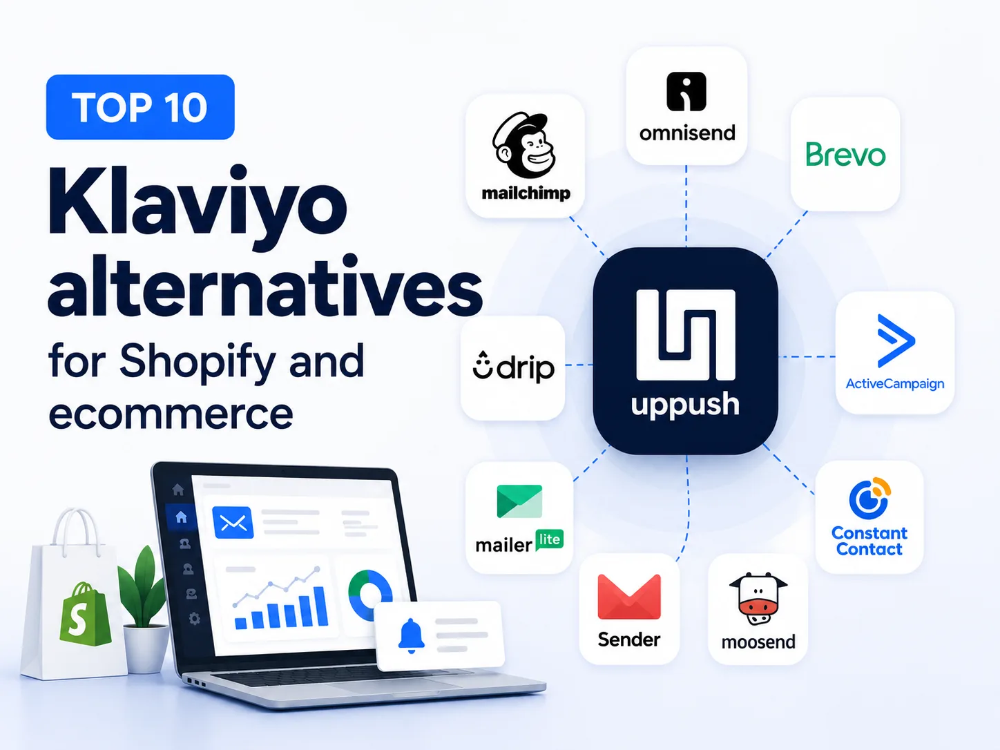

Klaviyo is one of the most well-known marketing platforms for ecommerce. It offers powerful email marketing, automation, segmentation, personalization, SMS, forms, and detailed customer data. For many growing stores, however, powerful does not always mean practical.

As your contact list grows, costs can increase quickly. Some smaller teams may also find that they are paying for advanced features they rarely use or spending too much time learning and managing the platform. Klaviyo’s pricing is based largely on active profiles. For example, its email plan was listed at around $100 per month for 5,000 active profiles and $150 for 10,000 in April 2026.

That makes it worth asking a simple question:

**Do you need everything Klaviyo offers, or do you need a simpler marketing platform that fits the way your business actually works?**

The answer depends on your store size, marketing channels, automation needs, and budget. Here are 10 Klaviyo alternatives worth considering in 2026.

## Klaviyo alternatives at a glance

| Platform | Best for | Main channels | Pricing approach |
| --- | --- | --- | --- |
| **Uppush** | Shopify stores focused on simple, cost-efficient automation | Email + Web Push | Pay-as-you-send |
| **Omnisend** | Ecommerce brands wanting multichannel marketing | Email + Web Push + SMS on eligible plans | Contact-based |
| **Mailchimp** | General email marketing | Email | Contact/send-based |
| **Brevo** | Large lists and multi-channel marketing | Email + SMS + WhatsApp + Web Push | Mainly send-volume based |
| **Drip** | Ecommerce behavioral automation | Email | Contact-based |
| **ActiveCampaign** | Advanced automation and CRM | Email + SMS + CRM | Contact/feature-based |
| **MailerLite** | Small businesses and simple email campaigns | Email | Subscriber-based |
| **Sender** | Small businesses needing a generous entry point | Email + SMS | Contact/send-based |
| **Constant Contact** | Traditional small businesses and events | Email + SMS | Contact-based |
| **Moosend** | Affordable email automation | Email | Subscriber-based |

The right choice isn’t simply the platform with the most features. It’s the one whose features, pricing model, and workflow match your business.

* * *

### 1\. Uppush — best for Shopify stores that want email + web push without contact-based pricing

For Shopify merchants looking for a simpler and more cost-efficient alternative to Klaviyo, [Uppush](https://apps.shopify.com/pushup-notification-marketing?st_source=uppush_web&st_position=blog_post_body) is a strong place to start. Uppush is built around a straightforward idea: **your marketing cost should depend more on what you send, not simply on how many contacts you’ve collected.**

Its Pro plan uses a pay-as-you-send model and supports unlimited contacts. Current Shopify App Store pricing starts at $12.99/month, including 3,000 emails and 3,000 web push impressions, with additional usage charged based on sending volume. This can make a significant difference for stores that continuously grow their subscriber lists but don’t necessarily need to contact every subscriber every month.

#### What you can do with Uppush

Uppush brings **email and web push notifications** together in one Shopify marketing platform. You can use it to:

-   Create and send email campaigns
-   Send web push campaigns
-   Recover abandoned carts and checkouts
-   Follow up after product browsing abandonment
-   Send back-in-stock notifications
-   Send price-drop notifications
-   Build automated marketing workflows
-   Segment and target customers
-   Collect subscribers through popups and spin wheels
-   Track campaign and automation performance

The free plan also includes unlimited subscribers alongside basic email and web push allowances, abandoned cart recovery, price-drop and back-in-stock automation, popups, spin wheels, and multi-language support.

#### Why choose Uppush over Klaviyo?

The biggest difference is simplicity and cost structure. Klaviyo offers a much broader and deeper marketing platform, which can be valuable for large brands with sophisticated data and segmentation requirements.

But not every Shopify merchant needs that level of complexity. If your main goal is to **capture visitors, automate follow-ups, recover lost sales, and communicate through email and web push**, Uppush covers these core ecommerce use cases without requiring you to pay simply because your contact list gets bigger.

Web push also gives stores another way to reconnect with visitors alongside email.

#### Where Uppush may not be the best fit

Uppush is Shopify-focused. If you need a full CRM, extensive B2B sales tools, or channels such as SMS and WhatsApp inside the same platform, other alternatives below may be a better match.

**Best for:** Shopify stores that want straightforward email and web push marketing, ecommerce automation, unlimited contacts, and costs that scale with sending activity rather than simply audience size.

* * *

### 2\. Omnisend — best for ecommerce-focused multichannel marketing

[Omnisend](https://www.omnisend.com) is one of Klaviyo’s closest competitors because both platforms focus heavily on ecommerce.

Omnisend combines email marketing with automation, segmentation, forms, web push notifications and SMS on eligible plans. It also provides pre-built ecommerce workflows, making it easier to create abandoned-cart, browse-abandonment and post-purchase sequences.

#### Why choose Omnisend?

Omnisend is useful if you want an ecommerce-focused platform without starting with Klaviyo’s more complex setup.

Its Free plan currently allows up to 500 emails per month to 250 contacts. Standard starts at $16/month and includes unlimited web push notifications, while Pro is aimed at higher-volume senders and adds SMS availability.

Its main strengths include:

-   Ecommerce automation
-   Email campaigns
-   Web push notifications
-   SMS on Pro
-   Segmentation
-   Signup forms
-   Pre-built workflows
-   Shopify integration

The trade-off is that costs still increase as your audience grows, and more advanced automation may not be as flexible as Klaviyo.

**Best for:** Small and mid-sized ecommerce businesses that want several marketing channels in one ecommerce-focused platform.

* * *

### 3\. Mailchimp — best for familiar, general-purpose email marketing

[Mailchimp](https://mailchimp.com) is probably one of the most recognizable names in email marketing.

Unlike Klaviyo, Mailchimp was not built specifically around ecommerce. It serves many kinds of businesses, including creators, agencies, service businesses, publishers, and online stores.

That can actually be an advantage if ecommerce is only one part of your marketing strategy.

Mailchimp provides email campaigns, templates, forms, segmentation, analytics and marketing automation.

Its interface is familiar to many marketers, and the platform has a large ecosystem of integrations.

The downside is that ecommerce-specific automation and behavioral targeting are not as central to the platform as they are with Klaviyo, Uppush, Omnisend, or Drip. Drip’s 2026 comparison, for example, notes that some ecommerce automation capabilities require Mailchimp’s Standard tier.

**Best for:** Businesses that mainly need email newsletters, basic automation and a well-established general marketing platform.

* * *

### 4\. Brevo — best for large contact lists and multi-channel communication

[Brevo](https://www.brevo.com) takes a different approach from many contact-based email platforms.

It combines email with SMS, WhatsApp, web push, marketing automation, transactional messaging, CRM features and other customer communication tools.

Its Free plan currently includes up to 300 email sends per day and storage for up to 100,000 contacts. Starter begins at $9/month, while Standard starts at $18/month and adds features such as more advanced automation, A/B testing and reporting.

#### Why choose Brevo?

Brevo can be attractive if you have a relatively large database but don’t send campaigns to everyone frequently.

It also makes sense if you want more than ecommerce marketing.

You can manage:

-   Email
-   SMS
-   WhatsApp
-   Web push
-   Transactional messages
-   Marketing automation
-   CRM and sales activities

That broader scope is also the trade-off. A Shopify merchant looking purely for ecommerce-focused marketing may find some other platforms more purpose-built for their workflow.

**Best for:** Businesses with larger contact databases or companies wanting marketing and customer communication tools beyond ecommerce.

* * *

### 5\. Drip — best for ecommerce behavioral automation

[Drip](https://www.drip.com) is another platform built strongly around ecommerce.

Its main strength is behavioral automation.

Instead of simply scheduling emails, businesses can create workflows based on actions customers take in their stores.

For example:

**Customer views product → adds to cart → leaves → receives follow-up → returns → purchases → enters post-purchase flow.**

Drip supports visual workflows, dynamic segmentation and ecommerce data from platforms including Shopify, WooCommerce and BigCommerce.

Its pricing starts at $39/month for up to 2,500 people, so it is not the cheapest option on this list.

However, stores that value sophisticated ecommerce automation without needing the full Klaviyo ecosystem may find it a strong alternative.

**Best for:** Established ecommerce businesses that care more about advanced behavioral automation than getting the lowest possible price.

* * *

### 6\. ActiveCampaign — best for advanced automation and CRM

[ActiveCampaign](https://www.activecampaign.com) is known for powerful automation.

Its visual automation builder can handle more complex customer journeys, conditions and branching logic than many simpler email tools.

It also combines marketing automation with CRM functionality.

That makes ActiveCampaign particularly useful when your customer journey extends beyond a normal ecommerce purchase.

For example, a company might need to manage:

**Lead → email nurture → sales conversation → purchase → follow-up → repeat customer.**

The trade-off is complexity. If you’re leaving Klaviyo because you want something significantly simpler, ActiveCampaign may not solve that particular problem.

Some ecommerce capabilities also require higher plans rather than the entry-level offering.

**Best for:** Businesses that need sophisticated automation and CRM capabilities alongside email marketing.

* * *

### 7\. MailerLite — best for small stores that want simplicity

[MailerLite](https://www.mailerlite.com) focuses heavily on making email marketing easy.

It offers:

-   Email campaigns
-   Drag-and-drop editing
-   Automation
-   Landing pages
-   Signup forms
-   Segmentation

Its free plan currently supports up to 500 subscribers and 12,000 monthly emails, while paid plans start around $10/month.

Compared with Klaviyo, however, MailerLite provides less depth around ecommerce behavior, predictive segmentation and revenue attribution.

That’s not necessarily a problem.

If you run a small store and mainly need newsletters, welcome emails and straightforward campaigns, paying for advanced ecommerce features you don’t use doesn’t make much sense.

**Best for:** Small stores, creators and businesses that prioritize ease of use and affordability.

* * *

### 8\. Sender — best for businesses looking for a generous free plan

[Sender](https://www.sender.net) is another budget-focused email marketing alternative.

Its free offering stands out because it supports up to 2,500 contacts and 15,000 emails per month, according to Drip’s June 2026 comparison. Automation, segmentation and signup forms are also available.

Sender integrates with ecommerce platforms including Shopify and WooCommerce, making it suitable for basic store automation.

However, businesses needing sophisticated branching, deep behavioral segmentation or advanced ecommerce analytics may eventually need a more specialized platform.

**Best for:** Small businesses that want to start email marketing with minimal upfront cost.

* * *

### 9\. Constant Contact — best for traditional small businesses

[Constant Contact](https://www.constantcontact.com) has a somewhat different audience from Klaviyo.

While Klaviyo focuses heavily on ecommerce, Constant Contact works well for traditional small businesses, organizations and companies that combine online marketing with events.

Its tools cover email marketing, templates, segmentation, A/B testing and automation, while its integrations extend into areas such as event management.

For a pure Shopify or DTC brand, there are stronger ecommerce-specific choices.

But if your business has a physical location, runs events, manages registrations or combines offline and online customer relationships, Constant Contact may be more practical.

**Best for:** Established small businesses that combine email, events and offline customer engagement.

* * *

### 10\. Moosend — best for affordable email automation

[Moosend](https://moosend.com) rounds out the list as a lower-cost email marketing option.

It provides email campaigns, segmentation, automation, visitor tracking and ecommerce features such as abandoned-cart workflows and product recommendations.

Paid plans start at around $7/month for 500 subscribers, with a free trial rather than a permanent free plan.

The main limitation is ecommerce integration depth. Businesses with complex Shopify data and sophisticated customer journeys may prefer a more ecommerce-specific platform.

For straightforward email automation, however, Moosend offers a useful balance between features and price.

**Best for:** Budget-conscious businesses that need more than basic newsletters but don’t need an enterprise-level ecommerce platform.

* * *

## How to choose the right Klaviyo alternative

There is no single Klaviyo alternative that is best for every business.

Instead of comparing feature lists alone, start with the problem you’re actually trying to solve.

If you’re running a Shopify store and primarily need **email + web push, subscriber capture, cart recovery and ecommerce automation without paying based on contact growth**, Uppush is worth considering.

If you want an ecommerce-focused platform with SMS and multiple channels, Omnisend may make more sense.

Mailchimp is a familiar option for general email marketing, while Brevo works particularly well when you have a large contact database or need several communication channels.

For deeper automation, Drip and ActiveCampaign are stronger candidates. And if simplicity and a low starting cost matter most, MailerLite, Sender or Moosend may be enough.

The key questions to ask are:

-   Which channels do you actually use?
-   How many contacts do you have?
-   How many messages do you send each month?
-   How complex are your automations?
-   Do you need ecommerce-specific customer behavior data?
-   How will your cost change as your audience grows?

That last question is especially important.

A platform that looks inexpensive at 500 contacts can become very different at 10,000, 50,000 or 100,000 contacts.

* * *

## Which Klaviyo alternative is best for Shopify?

For Shopify merchants, the decision usually comes down to how much complexity you actually need.

Klaviyo remains a powerful option for stores that need deep segmentation, predictive analytics and sophisticated customer data tools.

But smaller and growing Shopify stores don’t necessarily need an enterprise-level marketing stack.

If your strategy is centered around capturing visitors, sending email campaigns, using web push notifications and automatically recovering lost sales, **Uppush offers a simpler approach built specifically around those needs.**

Its unlimited-contact and pay-as-you-send model is particularly useful for stores that want to continue building their audience without seeing their marketing bill increase simply because more people subscribed.

For stores that need SMS alongside email and push, Omnisend is likely the more suitable option. And businesses that need CRM, WhatsApp, sales tools and broader customer communication may be better served by Brevo.

* * *

## Final thoughts

Klaviyo is powerful, but having more features doesn’t automatically make a platform better for your business.

The best marketing tool is the one that gives you the features you actually use at a cost that makes sense as you grow.

For Shopify stores, [Uppush on the Shopify App Store](https://apps.shopify.com/pushup-notification-marketing?st_source=uppush_web&st_position=blog_post_body) is worth considering if you want **email marketing, web push notifications, subscriber growth tools and ecommerce automation with unlimited contacts and pay-as-you-send pricing**.

Omnisend is a strong alternative for ecommerce businesses wanting broader multichannel marketing. Mailchimp remains a familiar choice for general email marketing, while Brevo stands out for businesses with larger databases and broader communication needs.

Before switching, don’t simply ask:

**“Which platform has more features?”**

Ask:

**“Which platform gives my store the features it actually needs—without making me pay for the ones it doesn’t?”**

That’s usually the better way to find the right Klaviyo alternative.
